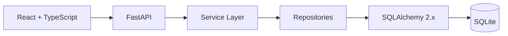

# Arquitetura do FinTrack

O FinTrack separa interface, API, regras de negócio e persistência para manter o código simples de evoluir. Não há autenticação ou entidades de usuário nesta versão.

## Camadas

- `api/routes`: valida entrada HTTP e devolve respostas.
- `services`: calcula resumos, evolução, orçamentos e insights determinísticos.
- `crud`: centraliza consultas SQLAlchemy.
- `models` e `schemas`: separam persistência e contratos de API.

O SQLite é isolado pela URL de configuração. Para uma futura mudança para PostgreSQL, basta trocar a URL e gerar as migrations necessárias.
